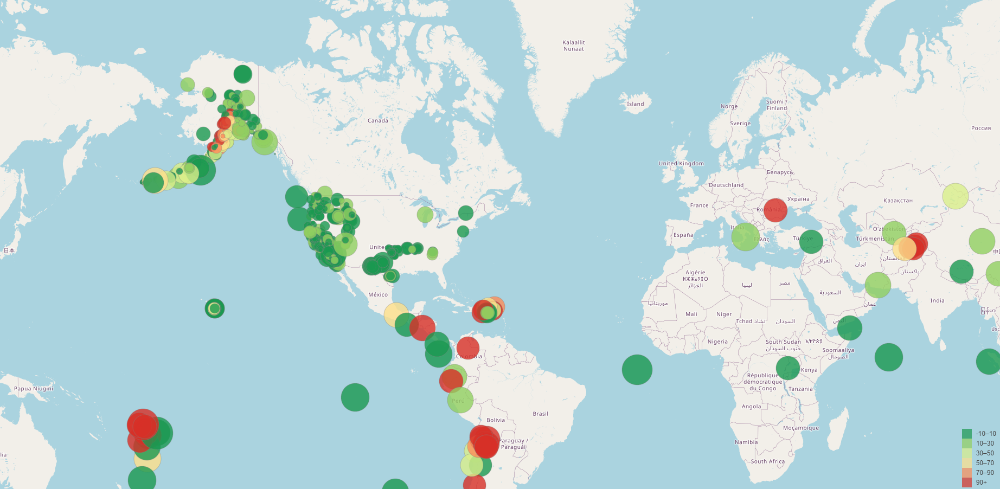
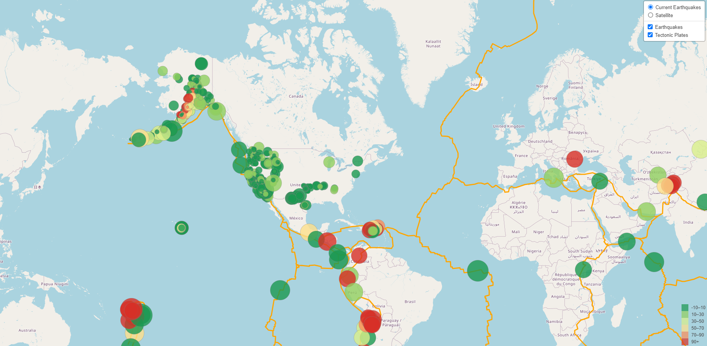

# Leaflet Challenge - Earthquake Map

## Background

The United States Geological Survey, or USGS for short, is responsible for providing scientific data about natural hazards, the health of our ecosystems and environment, and the impacts of climate and land-use change. Their scientists develop new methods and tools to supply timely, relevant, and useful information about the Earth and its processes.

The USGS is interested in building a new set of tools that will allow them to visualize their earthquake data. They collect a massive amount of data from all over the world each day, but they lack a meaningful way of displaying it. In this challenge, a visualization of USGS data is created to allow them to better educate the public and other government organizations (and hopefully secure more funding) on issues facing our planet.

The  project is separated into two parts:

Part 1: Create the Earthquake Visualization

Part 2: Gather and Plot More Data

## Part 1: Create the Earthquake Visualization

1.  Get the dataset:

The USGS provides earthquake data in a number of different formats, updated every 5 minutes. Visit the USGS page and select a dataset to visualize.
Link: https://earthquake.usgs.gov/earthquakes/feed/v1.0/geojson.php

By clicking the data  "All Earthquakes from the Past 7 Days a json representation of data is been given.
By pulling  the URL of the json Data the visualization is done.

2. Import and visualize the data:

Use Leaflet to create a map that plots all the earthquakes from the dataset based on their longitude and latitude:
* Data markers reflect the magnitude of the earthquake by their size and the depth of the earthquake by color. 
* Earthquakes with higher magnitudes appear larger, and earthquakes with greater depth appear darker in color.
Create a legend that will provide context for the map data.

## Part 2: Gather and Plot More Data 

Plot a second dataset on your map to illustrate the relationship between tectonic plates and seismic activity.
Data on tectonic plates can be found at https://github.com/fraxen/tectonicplatesLinks to an external site..

Perform the following tasks:

* Plot the tectonic plates dataset on the map in addition to the earthquakes.
* Add other base maps to choose from.
* Put each dataset into separate overlays that can be turned on and off independently.
* Add layer controls to the map.

